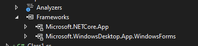

# net_notes

# Default loggging

Default logging json does not affect Serilog.
```json
  "Logging": {
    "LogLevel": {
      "Default": "Debug",
      "Microsoft.AspNetCore": "Warning"
    }
  }
```

# Serilog

To use Serilog, include the package `Serilog.AspNetCore`. In the `appsettings.json` configuration file, include the following section:

```json
 "Serilog": {
    "MinimumLevel": "Debug",
    "WriteTo": [
      {
        "Name": "Console",
        "Args": {
          "restrictedToMinimumLevel": "Information"
        }
      },
      {
        "Name": "File",
        "Args": {
          "path": "logs/logfile_project.txt",
          "rollingInterval": "Hour"
        }
      }
    ]
  }
```

To use in C# configure the `IHostBuilder`:

```cs
 var builder = 
            Host.
            CreateDefaultBuilder().
            ConfigureServices((context, services) =>
            {
                services
                //not needed for default builder
                //.AddLogging(o => o.AddConsole())
                .Configure<UcareOptions>(context.Configuration.GetSection(UcareOptions.UcareOptionsSection))
                //.Configure<HostOptions>(options => options.ShutdownTimeout = TimeSpan.FromSeconds(15))
                .....  
                ;
            }).UseSerilog((context, configuration) =>
            {
                //NUGET: Serial.Settings.Configuration
                //for configuration see: https://github.com/serilog/serilog-settings-configuration
                configuration.ReadFrom.Configuration(context.Configuration); //read Serilog options from appsettings.json

                //configuration.MinimumLevel.Debug();
                //configuration.WriteTo.Console(restrictedToMinimumLevel:Serilog.Events.LogEventLevel.Information);
                //configuration.WriteTo.File(path: "logs/myapp.txt", rollingInterval: RollingInterval.Hour);
            }); //IHostBuilder

```

# Winforms logging with `ILogger`

The project file of the class library should be edited to allow the use of Windows Forms controls. Also, the project type should be bound to Windows:
```xml
<Project Sdk="Microsoft.NET.Sdk.WindowsDesktop">
	<PropertyGroup>
		<TargetFramework>net6.0-windows</TargetFramework>
		<ImplicitUsings>enable</ImplicitUsings>
		<Nullable>enable</Nullable>
		<UseWindowsForms>true</UseWindowsForms>
	</PropertyGroup>
</Project>

```

The dependencies should appear as below:
.


